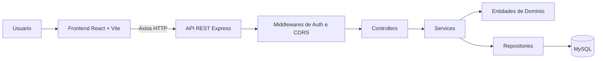
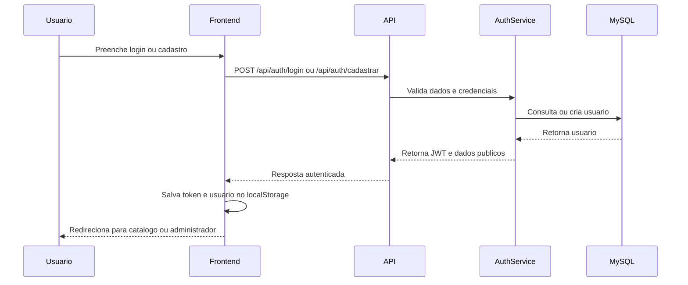
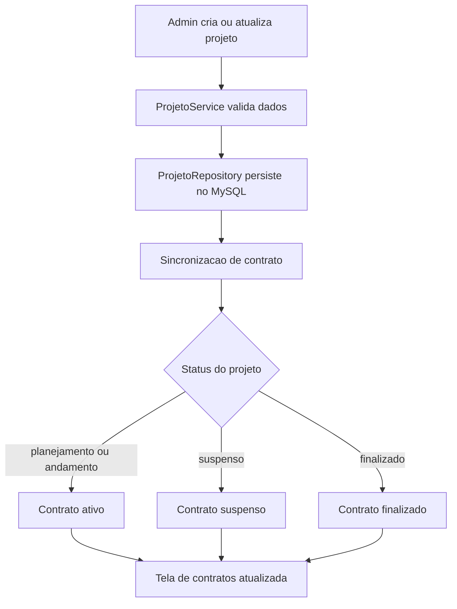
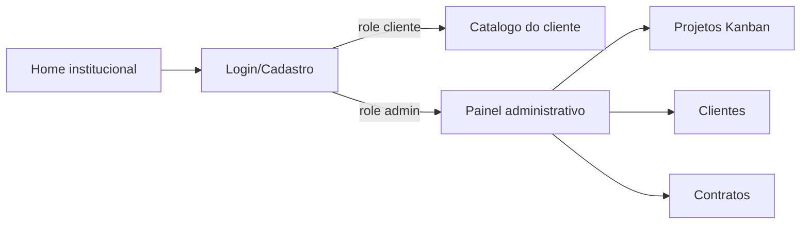
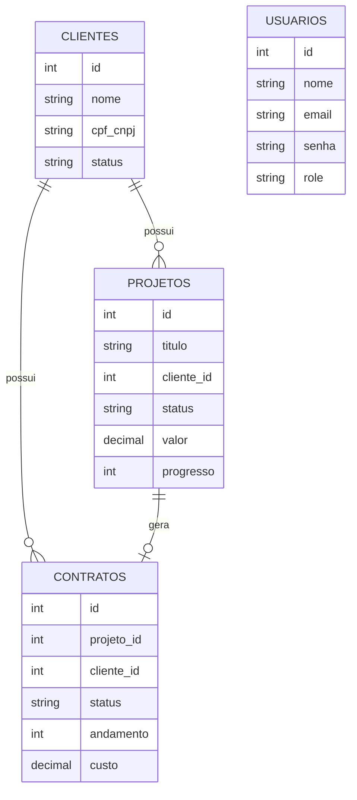

# Projeto MRL

<div align="center">


**Sistema full stack para apresentacao institucional, cadastro de clientes, catalogo de servicos e gestao administrativa de projetos e contratos.**

Projeto desenvolvido no contexto do **4º semestre da faculdade**, com foco em desenvolvimento web full stack, arquitetura em camadas, integracao com banco de dados, autenticacao e boas praticas de organizacao de codigo.

</div>

---

## Sumario

- [Visao Geral](#visao-geral)
- [Contexto Academico](#contexto-academico)
- [Funcionalidades](#funcionalidades)
- [Tecnologias Utilizadas](#tecnologias-utilizadas)
- [Arquitetura](#arquitetura)
- [Estrutura de Pastas](#estrutura-de-pastas)
- [Fluxos Principais](#fluxos-principais)
- [API REST](#api-rest)
- [Banco de Dados](#banco-de-dados)
- [Como Executar Localmente](#como-executar-localmente)
- [Execucao em Producao/Web](#execucao-em-producaoweb)
- [Testes](#testes)
- [Diferenciais do Projeto](#diferenciais-do-projeto)
- [Aprendizados Academicos](#aprendizados-academicos)
- [Roadmap](#roadmap)
- [Autor](#autor)

---

## Visao Geral

O **Projeto MRL** e uma aplicacao web desenvolvida para a **MRL Desenvolvimento de Software e Tecnologias**, reunindo uma pagina institucional, uma area de autenticacao, um catalogo de servicos para clientes e um painel administrativo protegido.

O sistema resolve a necessidade de organizar, em uma unica plataforma, a apresentacao dos servicos da empresa e a administracao interna de **clientes**, **projetos** e **contratos**. A solucao tambem demonstra, de forma pratica, conceitos importantes de desenvolvimento full stack estudados durante a formacao academica.

### Objetivo principal

Construir uma aplicacao full stack funcional, com frontend moderno, backend estruturado, persistencia em banco relacional, autenticacao segura e separacao clara de responsabilidades entre interface, regras de negocio, rotas, servicos e repositorios.

### Publico-alvo

| Perfil | Uso no sistema |
| --- | --- |
| Visitantes | Conhecem a MRL, seus servicos, diferenciais e canais de contato. |
| Clientes | Criam conta, fazem login e acessam o catalogo de servicos. |
| Administradores | Gerenciam clientes, projetos e acompanham contratos sincronizados. |
| Avaliadores academicos | Analisam arquitetura, tecnologias, organizacao, testes e aplicacao dos conceitos estudados. |

---

## Contexto Academico

Este projeto foi desenvolvido como trabalho do **4º semestre** do curso de **Analise e Desenvolvimento de Sistemas**, conectando teoria e pratica em um produto web completo.

Entre os conceitos aplicados estao:

- Desenvolvimento de interfaces com componentes reutilizaveis.
- Consumo de API REST pelo frontend.
- Criacao de API com Node.js e Express.
- Autenticacao com JWT e controle de acesso por perfil.
- Persistencia em banco de dados MySQL.
- Organizacao do backend em camadas.
- Validacao de dados no frontend e no backend.
- Testes automatizados de servicos.
- Inicializacao automatica e idempotente do banco.

> O projeto tem valor academico por demonstrar dominio progressivo da stack e valor profissional por simular um sistema real de gestao empresarial.

---

## Funcionalidades

### Area institucional

- **Pagina inicial da MRL**  
  Apresenta a empresa, sua proposta de valor, especializacoes e identidade visual.

- **Secao de servicos**  
  Exibe servicos como desenvolvimento web, mobile, desktop, e-commerce, microservicos/APIs, DevOps & Cloud, automacao, suporte e sistemas corporativos.

- **Carrossel interativo de servicos**  
  Permite navegacao visual pelos servicos, com animacao continua e controle manual.

- **Avaliacoes e rodape institucional**  
  Inclui depoimentos, identidade da empresa e links de contato.

### Autenticacao e autorizacao

- **Cadastro de usuarios clientes**  
  Cria usuarios com nome, e-mail, senha, CPF/CNPJ e telefone, aplicando validacoes de formato e seguranca.

- **Login com JWT**  
  Autentica usuarios, armazena token e dados publicos no `localStorage` e direciona o usuario conforme seu perfil.

- **Criptografia de senha**  
  Senhas sao armazenadas com hash usando `bcryptjs`.

- **Rotas protegidas**  
  A area administrativa exige usuario logado com perfil `admin`. Clientes autenticados acessam o catalogo.

- **Logout com confirmacao**  
  Remove dados de sessao e retorna o usuario para a pagina inicial.

### Catalogo do cliente

- **Catalogo protegido para clientes logados**  
  Lista servicos da MRL em cards visuais.

- **Busca por servico**  
  Filtra os cards pelo titulo do servico.

- **Filtro por categoria**  
  Organiza os servicos em categorias como criacao de novos sistemas, integracao e automacao, manutencao e suporte.

- **Contato via WhatsApp**  
  Cada servico possui chamada para contato externo com mensagem pre-preenchida.

- **Correção de posicionamento ao entrar no catalogo**  
  Ao acessar o catalogo por login, cadastro, redirecionamento ou atualizacao da rota, a pagina inicia no topo.

### Painel administrativo

- **Dashboard administrativo protegido**  
  Interface com sidebar, perfil do administrador, alternancia de tema e navegacao por modulos.

- **Gerenciador de projetos em Kanban**  
  Projetos sao exibidos por status: planejamento, em andamento, finalizados e suspensos.

- **Cadastro e edicao de projetos**  
  Permite informar titulo, cliente vinculado, CPF/CNPJ, datas, valor, progresso, descricao e status.

- **Validacoes de projeto**  
  Verifica cliente obrigatorio, titulo valido, datas em formato brasileiro, previsao de entrega posterior ou igual a data de contratacao e progresso entre 0 e 100.

- **Exclusao de projetos com confirmacao**  
  Remove projeto apos confirmacao visual.

- **Gestao de clientes**  
  Permite listar, buscar, cadastrar, editar, filtrar por status e excluir clientes.

- **Resumo financeiro e operacional por cliente**  
  A listagem de clientes apresenta custo associado e quantidade de contratos existentes.

- **Consulta de contratos**  
  Exibe contratos derivados dos projetos, com projeto, cliente, andamento, custo e status.

- **Filtros de contratos**  
  Permite filtrar contratos por status e buscar por projeto ou cliente.

- **Sincronizacao automatica de contratos**  
  Contratos nao sao gerenciados manualmente pela interface. Eles sao criados e atualizados a partir dos projetos, preservando consistencia entre projeto, cliente, andamento, custo e status.

### Infraestrutura e dados

- **Inicializacao automatica do banco**  
  Ao iniciar o backend, o sistema valida conexao, sincroniza tabelas, remove registros orfaos e executa seeds.

- **Seeds idempotentes**  
  Clientes, projetos, contratos e administrador inicial sao verificados/criados sem duplicacao em reinicializacoes.

- **Health check da API**  
  Endpoint `/api/health` confirma disponibilidade do backend.

---

## Tecnologias Utilizadas

| Categoria | Tecnologias |
| --- | --- |
| Linguagens | JavaScript, JSX, SQL, CSS |
| Frontend | React, Vite, React Router DOM, Axios |
| Backend | Node.js, Express, CORS, dotenv |
| Banco de dados | MySQL, mysql2/promise |
| Autenticacao | JSON Web Token, bcryptjs |
| Testes | Jest |
| Qualidade | ESLint, validacoes customizadas, separacao em camadas |
| Desenvolvimento | npm, Nodemon, Vite Dev Server |
| Deploy identificado | Frontend preparado para Vercel; backend com suporte HTTP/HTTPS configuravel |
| Servicos externos | WhatsApp link para contato comercial |

---

## Arquitetura

O projeto segue uma arquitetura cliente-servidor, com frontend React consumindo uma API REST em Express. No backend, a organizacao separa responsabilidades em camadas inspiradas em arquitetura limpa: dominio, aplicacao, infraestrutura e apresentacao.



### Responsabilidades por camada

| Camada | Pasta | Responsabilidade |
| --- | --- | --- |
| Interface | `frontend/src/pages`, `frontend/src/components` | Telas, formularios, navegacao, experiencia visual e interacoes do usuario. |
| Servicos frontend | `frontend/src/services` | Comunicacao com a API, injecao de token e tratamento de expiracao de sessao. |
| Apresentacao backend | `backend/src/presentation` | Rotas HTTP, controllers e middlewares de autenticacao/autorizacao. |
| Aplicacao | `backend/src/application/services` | Regras de negocio e orquestracao entre entidades e repositorios. |
| Dominio | `backend/src/domain` | Entidades, validacoes centrais e contratos de repositorio. |
| Infraestrutura | `backend/src/infrastructure/repositories` | Persistencia e consultas SQL no MySQL. |
| Banco | `backend/src/database` | Schema, seeds, inicializacao e sincronizacao de contratos. |
| Configuracao | `backend/src/config` | Pool MySQL e variaveis de ambiente. |
| Testes | `backend/src/tests` | Testes unitarios dos servicos de negocio. |

---

## Estrutura de Pastas

```text
Projeto-MRL-React/
|-- backend/
|   |-- server.js
|   |-- src/
|   |   |-- application/
|   |   |   |-- services/
|   |   |-- config/
|   |   |-- database/
|   |   |-- domain/
|   |   |   |-- entities/
|   |   |   |-- repositories/
|   |   |-- infrastructure/
|   |   |   |-- repositories/
|   |   |-- presentation/
|   |   |   |-- controllers/
|   |   |   |-- middlewares/
|   |   |   |-- routes/
|   |   |-- tests/
|   |-- package.json
|
|-- frontend/
|   |-- src/
|   |   |-- assets/
|   |   |-- components/
|   |   |-- hooks/
|   |   |-- pages/
|   |   |-- services/
|   |   |-- styles/
|   |   |-- utils/
|   |-- package.json
|
|-- README.md
|-- .gitignore
```

---

## Fluxos Principais

### Fluxo de autenticacao



### Fluxo de projetos e contratos



### Fluxo de navegacao



---

## API REST

Base local padrao:

```text
http://localhost:3001/api
```

### Autenticacao

| Metodo | Rota | Protecao | Descricao |
| --- | --- | --- | --- |
| `POST` | `/auth/cadastrar` | Publica | Cadastra usuario cliente e retorna token. |
| `POST` | `/auth/login` | Publica | Autentica usuario e retorna token. |

### Clientes

Todas as rotas abaixo exigem token JWT e perfil `admin`.

| Metodo | Rota | Descricao |
| --- | --- | --- |
| `GET` | `/clientes` | Lista clientes. |
| `GET` | `/clientes/:id` | Busca cliente por ID. |
| `POST` | `/clientes` | Cria cliente. |
| `PUT` | `/clientes/:id` | Atualiza cliente. |
| `DELETE` | `/clientes/:id` | Remove cliente. |

### Projetos

Todas as rotas abaixo exigem token JWT e perfil `admin`.

| Metodo | Rota | Descricao |
| --- | --- | --- |
| `GET` | `/projetos` | Lista projetos com dados do cliente. |
| `GET` | `/projetos/:id` | Busca projeto por ID. |
| `POST` | `/projetos` | Cria projeto e sincroniza contrato. |
| `PUT` | `/projetos/:id` | Atualiza projeto e sincroniza contrato. |
| `DELETE` | `/projetos/:id` | Remove projeto. |

### Contratos

Todas as rotas abaixo exigem token JWT e perfil `admin`.

| Metodo | Rota | Descricao |
| --- | --- | --- |
| `GET` | `/contratos` | Lista contratos. |
| `GET` | `/contratos/:id` | Busca contrato por ID. |
| `POST` | `/contratos` | Rota existente, mas bloqueada pela regra de negocio. |
| `PUT` | `/contratos/:id` | Rota existente, mas bloqueada pela regra de negocio. |
| `DELETE` | `/contratos/:id` | Rota existente, mas bloqueada pela regra de negocio. |

### Health check

| Metodo | Rota | Descricao |
| --- | --- | --- |
| `GET` | `/health` | Retorna `{ "status": "ok" }`. |

---

## Banco de Dados

Banco padrao:

```text
mrl_db
```

Tabelas criadas automaticamente:

| Tabela | Finalidade |
| --- | --- |
| `usuarios` | Usuarios clientes e administradores, com senha criptografada e perfil de acesso. |
| `clientes` | Dados de clientes administrados pela empresa. |
| `projetos` | Projetos vinculados a clientes. |
| `contratos` | Contratos sincronizados automaticamente a partir dos projetos. |

### Relacionamentos



### Regras de sincronizacao de contratos

| Status do projeto | Status do contrato |
| --- | --- |
| `planejamento` | `ativo` |
| `andamento` | `ativo` |
| `suspenso` | `suspenso` |
| `finalizado` | `finalizado` |

O andamento do contrato acompanha o progresso do projeto, e o custo do contrato acompanha o valor do projeto.

---

## Como Executar Localmente

### Pre-requisitos

- Node.js 18 ou superior.
- npm.
- MySQL Server em execucao.
- Git.

### 1. Clonar o repositorio

```bash
git clone <url-do-repositorio>
cd Projeto-MRL-React
```

### 2. Configurar o backend

```bash
cd backend
npm install
```

Crie ou atualize o arquivo `backend/.env`:

```env
PORT=3001
HTTPS_PORT=3001

DB_HOST=localhost
DB_PORT=3306
DB_USER=root
DB_PASSWORD=sua_senha_do_mysql
DB_NAME=mrl_db
DB_CONNECTION_LIMIT=10

JWT_SECRET=troque_por_um_segredo_forte
JWT_EXPIRES_IN=7d

ADMIN_EMAIL=admin@mrl.com
ADMIN_PASSWORD=admin123

CORS_ORIGIN=http://localhost:5173
HTTPS_ENABLED=false
SSL_ENABLED=false
SSL_KEY_PATH=./certs/key.pem
SSL_CERT_PATH=./certs/cert.pem
```

> Nao publique valores reais de `.env`. O arquivo deve ser mantido localmente.

Inicie o backend:

```bash
npm run dev
```

API local:

```text
http://localhost:3001/api
```

Health check:

```text
http://localhost:3001/api/health
```

### 3. Configurar o frontend

Em outro terminal:

```bash
cd frontend
npm install
```

Opcionalmente, configure `frontend/.env` se quiser alterar a URL da API:

```env
VITE_API_URL=http://localhost:3001/api
```

Inicie o frontend:

```bash
npm run dev
```

Aplicacao local:

```text
http://localhost:5173
```

### Usuario administrador inicial

O backend cria o administrador inicial a partir das variaveis:

```text
ADMIN_EMAIL
ADMIN_PASSWORD
```

No exemplo de configuracao:

```text
E-mail: admin@mrl.com
Senha: admin123
```

---

## Execucao em Producao/Web

O codigo identifica o frontend hospedado em:

```text
https://projeto-mrl-react.vercel.app
```

Essa URL aparece como origem permitida padrao no CORS do backend. Caso o deploy seja alterado, atualize `CORS_ORIGIN` no backend.

### Build do frontend

```bash
cd frontend
npm run build
```

### Preview local da build

```bash
npm run preview
```

### Backend em producao

```bash
cd backend
npm start
```

O backend possui suporte opcional a HTTPS quando `HTTPS_ENABLED=true` ou `SSL_ENABLED=true` e os certificados configurados em `SSL_KEY_PATH` e `SSL_CERT_PATH` existem.

---

## Testes

O backend possui testes unitarios com Jest para servicos de negocio.

### Executar testes

```bash
cd backend
npm test -- --watchAll=false --runInBand
```

### Escopo atual

| Arquivo | Objetivo |
| --- | --- |
| `backend/src/tests/AuthService.test.js` | Valida cadastro, login, senha com hash, token JWT e rejeicao de credenciais invalidas. |
| `backend/src/tests/ClienteService.test.js` | Valida listagem, criacao, atualizacao, exclusao e tratamento de cliente inexistente. |

### Objetivos dos testes

- Proteger regras de autenticacao.
- Validar regras de negocio sem depender do banco real.
- Garantir que servicos chamem os repositorios corretamente.
- Servir como documentacao executavel para apresentacao academica.

---

## Diferenciais do Projeto

- **Arquitetura em camadas** com separacao entre apresentacao, aplicacao, dominio, infraestrutura e banco.
- **Autenticacao com JWT** e controle de acesso por perfil.
- **Senha protegida com hash** antes da persistencia.
- **Interceptors Axios** para injecao automatica de token e tratamento de sessao expirada.
- **Validacoes no frontend e no backend**, reduzindo erros de entrada e melhorando consistencia.
- **Inicializacao idempotente do banco**, com schema e seeds seguros contra duplicacao.
- **Sincronizacao automatica de contratos**, evitando inconsistencia entre modulos.
- **Interface responsiva e orientada a UX**, com modais, filtros, busca, toasts, confirmacoes e alternancia de tema.
- **Testes automatizados** para regras centrais.
- **Organizacao adequada para portfolio**, com frontend e backend independentes.

---

## Aprendizados Academicos

Durante o desenvolvimento, o projeto permitiu praticar:

- Modelagem de entidades e relacionamentos em banco relacional.
- Criacao de APIs REST com Express.
- Consumo de APIs com React e Axios.
- Gerenciamento de estado local em componentes React.
- Navegacao com React Router DOM.
- Controle de autenticacao e autorizacao.
- Protecao de rotas por perfil de usuario.
- Validacao, sanitizacao e mascaras de entrada.
- Organizacao modular de CSS e componentes.
- Testes unitarios com mocks.
- Analise de fluxo completo entre usuario, frontend, backend e banco.

### Desafios enfrentados

| Desafio | Solucao aplicada |
| --- | --- |
| Manter contratos coerentes com projetos | Sincronizacao automatica a partir dos dados do projeto. |
| Evitar duplicacao de dados iniciais | Seeds idempotentes baseados em verificacoes previas. |
| Controlar acesso administrativo | Middleware JWT e verificacao de role `admin`. |
| Melhorar confiabilidade dos formularios | Validacoes e mascaras no frontend, alem de validacoes no dominio. |
| Preservacao indevida de scroll no catalogo | Reposicionamento no topo ao montar a pagina de catalogo. |

---

## Roadmap

- [ ] Ampliar a cobertura de testes para ProjetoService, ContratoService, controllers e repositories.
- [ ] Adicionar testes de integracao da API com banco de teste.
- [ ] Criar pagina de perfil do cliente.
- [ ] Permitir que clientes acompanhem seus proprios projetos e contratos.
- [ ] Adicionar dashboard administrativo com indicadores agregados.
- [ ] Implementar paginacao em clientes, projetos e contratos.
- [ ] Adicionar logs estruturados no backend.
- [ ] Criar documentacao OpenAPI/Swagger para a API.
- [ ] Melhorar acessibilidade com revisao completa de ARIA, foco e navegacao por teclado.
- [ ] Configurar pipeline de CI para build, lint e testes.

---

## Autor

**Desenvolvedora:** Isabella Braga  
**Curso:** Analise e Desenvolvimento de Sistemas  
**Periodo:** 4º semestre  
**Projeto:** Sistema full stack academico e profissional para a MRL Desenvolvimento de Software e Tecnologias

### Links identificados no projeto

| Canal | Link |
| --- | --- |
| GitHub | [github.com/MiraelRibeiro](https://github.com/MiraelRibeiro) |
| LinkedIn | [linkedin.com/in/mirael-ribeiro-dev](https://www.linkedin.com/in/mirael-ribeiro-dev/) |
| Instagram | [instagram.com/mrltech.br](https://www.instagram.com/mrltech.br/) |
| WhatsApp | [Contato comercial](https://wa.me/5519997077633) |

---

<div align="center">

**Projeto MRL**  
Documentacao preparada para apresentacao academica, avaliacao tecnica e portfolio profissional.

</div>
